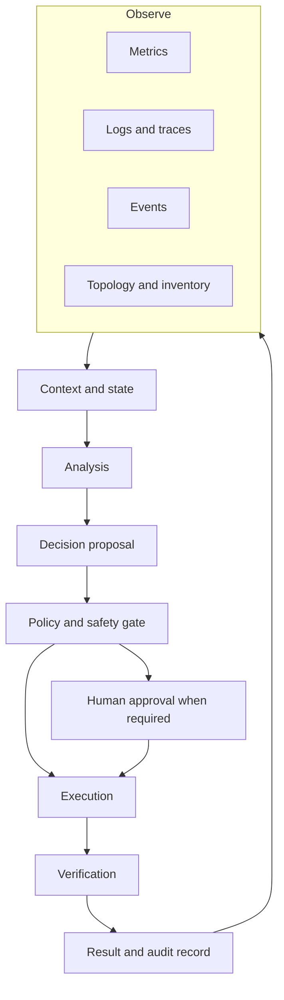

# Closed-loop automation

## Why the loop matters

A dashboard is not an autonomous system. A prediction is not an action. A script is not a closed loop unless the system can observe the result of its action and decide what to do next.

A closed loop connects five responsibilities:

* **Observe:** collect measurements, events, logs, traces and topology context.
* **Analyze:** detect a condition, estimate a state or predict a future outcome.
* **Decide:** select an action under policy, safety and authorization constraints.
* **Act:** change configuration, capacity, routing, placement or traffic treatment.
* **Verify:** test whether the intended outcome occurred and whether side effects appeared.

The loop can be implemented with simple rules, statistical models, optimization, reinforcement learning or an agent. The loop structure is more fundamental than the model choice.

## Reference architecture

## Control-loop timing

Not every decision belongs at the same timescale. A packet-level forwarding decision may require deterministic processing. A capacity forecast may operate hourly. A maintenance plan may operate weekly. Mixing these timescales creates brittle systems: a slow model can be asked to solve a fast control problem, or a fast actuator can apply a long-horizon forecast without enough context.

A practical design labels each loop with:

* sensing interval
* decision deadline
* action duration
* rollback window
* verification window
* escalation timeout

## Where AI helps

AI can improve a loop by detecting weak signals, ranking likely causes, forecasting demand, recommending actions or learning a policy from historical outcomes. It can also make the loop harder to operate when the model is poorly calibrated, the training data is stale or the action space is not constrained.

A useful division of labor is:

* deterministic policy for hard safety boundaries
* statistical detection for anomaly candidates
* model-based recommendation for complex trade-offs
* controlled execution for changes
* independent verification for the claimed outcome

This architecture treats the model as one decision component, not as the entire control plane.

## Failure modes

### Alert-driven thrashing

If every alert triggers an action, the system can oscillate. Add hysteresis, minimum dwell times, action budgets and a state machine that distinguishes transient noise from persistent degradation.

### Good local action, bad global outcome

A change may improve one slice or region while degrading another. Evaluate at the service and domain boundaries that matter, not only at the component where the action was taken.

### Unobservable action

If an action cannot be measured afterward, the system cannot learn whether it worked. Define verification signals before enabling the actuator.

### Silent policy drift

A model can remain unchanged while traffic patterns, topology, software versions or business priorities change. Track the input distribution, decision distribution and outcome distribution over time.

## Design checklist

* What state is the loop estimating?
* Which evidence is authoritative and which is advisory?
* What actions are reversible?
* What is the maximum blast radius?
* Which changes require approval?
* What independent signal verifies success?
* What happens when telemetry is missing or contradictory?
* How does the loop degrade when the model is unavailable?

## Further reading

* [ETSI Zero-touch network and Service Management](https://www.etsi.org/technical-groups/zsm/): a standards-oriented view of end-to-end automation and management.
* [ETSI Experiential Networked Intelligence](https://www.etsi.org/technical-groups/eni/): an AI-oriented view of experience-driven and self-managing networks.
* [TM Forum Autonomous Networks](https://www.tmforum.org/missions/autonomous-networks): maturity, architecture and business framing for network autonomy.
