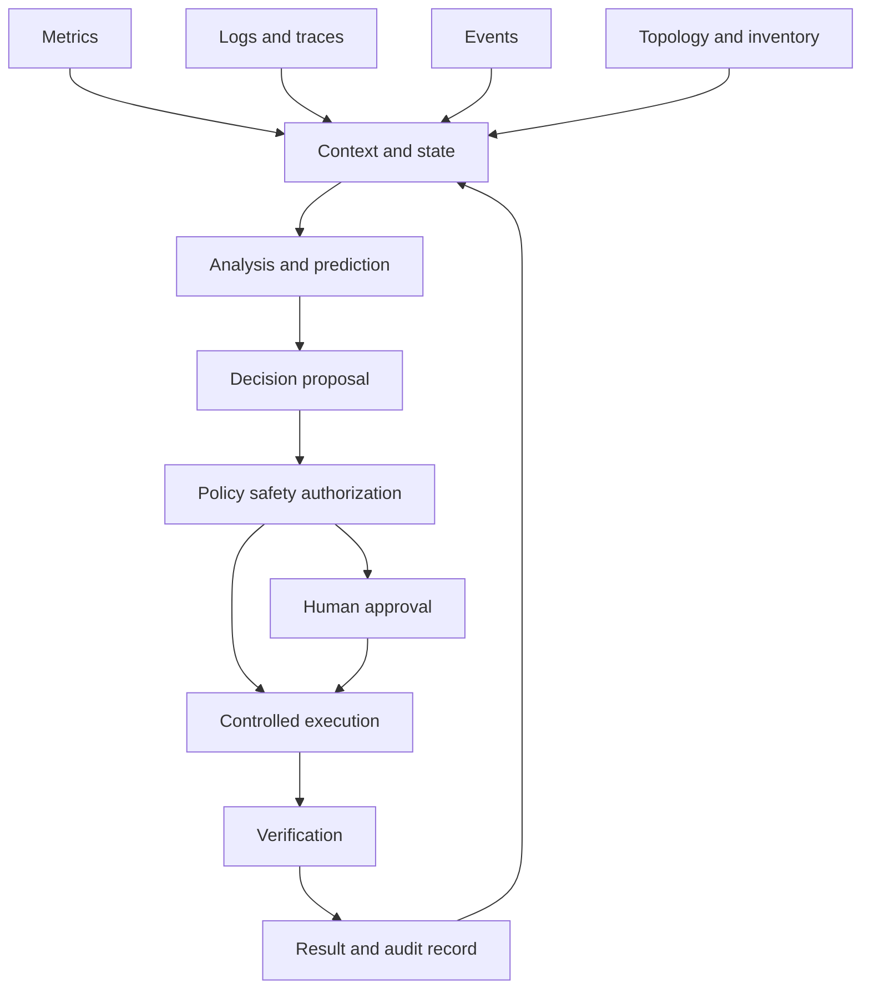

# Closed-loop automation

## A loop is more than a dashboard

A dashboard describes a system to a person. A prediction describes what may happen. A runbook describes what someone could do. A closed loop connects observation to action and then checks whether the action produced the intended result.

A useful abstraction has six stages:

1. **Observe** measurements, events, logs, traces, topology and configuration.
2. **Establish state** by combining evidence into a time-bounded view of the system.
3. **Analyze** detect a condition, estimate a state or forecast an outcome.
4. **Decide** choose an action under policy, authorization and resource constraints.
5. **Act** change a configuration, placement, route, capacity or workflow state.
6. **Verify** test the target outcome and look for unintended effects.

The loop can use deterministic rules, statistics, optimization, reinforcement learning or an agent. The loop is the architecture; the model is a component inside it.

## Reference architecture

The arrows are contracts. Each contract should define the data shape, timestamp semantics, ownership, failure behavior and evidence needed to continue.

## Timescales are architecture

A packet forwarding decision, a session-management decision, a capacity forecast and a maintenance plan operate at different timescales. A slow reasoning system cannot sit in a hard real-time path. A fast actuator should not apply a long-horizon forecast without checking whether the forecast is still valid.

For each loop, record:

| Property | Question |
|---|---|
| Sensing interval | How often is new evidence collected? |
| Decision deadline | How long can analysis take before the decision is stale? |
| Action duration | How long does the change affect the system? |
| Dwell time | How long must the state persist before another action is allowed? |
| Rollback window | How quickly can the action be reversed? |
| Verification window | When should the outcome be measurable? |
| Escalation timeout | When does the loop stop and ask for help? |

## A practical autonomy ladder

A safe progression is more useful than a binary autonomous/not-autonomous label:

- **Observe:** collect and visualize evidence.
- **Explain:** connect symptoms to likely causes with provenance.
- **Recommend:** propose an action and show expected impact.
- **Guarded act:** execute a narrow reversible action under a policy gate.
- **Closed loop:** execute, verify and stop when the objective is met.
- **Adaptive loop:** update strategy through controlled change management.

Every step needs an exit criterion. “The demo looked good” is not an exit criterion.

## Worked example: congestion response

Imagine a region where signaling latency is rising. A useful loop does not immediately scale every function. It first checks whether the signal is real, whether the degradation is localized, and whether a dependency or recent change explains the pattern.

A bounded decision might be:

- observe signaling latency, request rate, timeout rate and instance saturation;
- compare the current window with a baseline for the same traffic pattern;
- identify whether the symptom is isolated to a function, zone, slice or access region;
- propose adding capacity in one zone with a fixed budget;
- require the policy gate to preserve redundancy and avoid simultaneous changes elsewhere;
- execute an idempotent scaling action;
- verify latency, error rate, placement health and capacity headroom;
- roll back or escalate if the expected improvement does not appear.

The model may help classify the incident, but the safety envelope should not depend on the model being correct in every case.

## Common failure modes

### Alert-driven thrashing

If every alert triggers an action, noise becomes oscillation. Use hysteresis, minimum dwell times, action budgets and an explicit state machine.

### Local optimization

An action can improve a component metric while degrading a service, region or customer cohort. Evaluate at the boundary where the objective is defined.

### Unobservable actuation

If the action cannot be measured afterward, the system cannot distinguish success from coincidence. Define verification signals before enabling the actuator.

### Stale context

A recommendation based on old topology, policy or software-version data can be worse than no recommendation. Carry timestamps and freshness limits through the loop.

### Conflicting controllers

Two loops can each be locally reasonable and globally unstable. Assign ownership for every actuator and publish coordination rules.

## Design checklist

- State the objective as an observable outcome.
- Identify hard constraints before choosing a model.
- Separate recommendation from authorization.
- Make actions idempotent and bounded.
- Define an independent verification signal.
- Decide what happens when telemetry is missing or contradictory.
- Keep an audit record of evidence, decision, action and result.
- Test failure and recovery scenarios, not only normal traffic.

## Exercise

Choose a network or IT symptom. Draw the six stages. For every arrow, write the input, freshness requirement, owner and failure behavior. If you cannot name the actuator or verification signal, keep the design at the explain or recommend level.

## Further reading

- [ETSI Zero-touch network and Service Management](https://www.etsi.org/technical-groups/zsm/)
- [ETSI Experiential Networked Intelligence](https://www.etsi.org/technical-groups/eni/)
- [TM Forum Autonomous Networks](https://www.tmforum.org/missions/autonomous-networks)
