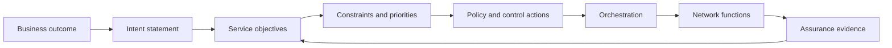

# Intent and assurance

## Intent is not a natural-language wish

“Give premium users the best experience” is a direction, not an executable intent. An operating system needs a target, scope, constraints, priorities, evidence and a response to conflict.

A useful intent statement answers:

- **Outcome:** what should improve?
- **Scope:** which service, slice, region, tenant or cohort is affected?
- **Objective:** which measurable indicators represent success?
- **Constraints:** what must not be violated?
- **Priority:** which objective wins when objectives conflict?
- **Time:** when does the intent apply and when does it expire?
- **Authority:** which component may interpret or execute it?
- **Assurance:** what evidence proves that it is being met?

## From intent to control

The translation step is where ambiguity becomes dangerous. If the system silently invents a priority or converts a vague objective into an aggressive control action, the resulting behavior may be consistent but wrong.

## Assurance as a feedback contract

Assurance is not a report written after an incident. It is a continuous contract between the stated objective and the evidence that supports it.

For an objective, define:

| Element | Example question |
|---|---|
| Indicator | Which measurement represents the outcome? |
| Aggregation | Average, percentile, worst cohort or threshold breach? |
| Window | Which time interval is meaningful? |
| Attribution | Which service or change contributed to the result? |
| Confidence | How complete and reliable is the evidence? |
| Response | What action follows a breach? |
| Recovery | How do we know the objective is restored? |

A single average can hide a failing cohort. A single alarm can miss a gradual degradation. Assurance must match the shape of the objective.

## Conflicting intents

Conflicts are normal. A latency objective may compete with energy efficiency. A premium service may compete with fairness across tenants. Resilience may require spare capacity that reduces utilization.

Resolve conflict explicitly:

1. identify the affected scopes;
2. rank objectives and constraints;
3. calculate the feasible action set;
4. choose the least harmful action when no option satisfies everything;
5. record the decision and its rationale;
6. notify the owner when the conflict exceeds policy.

A language model can help explain the conflict, but it should not silently invent the priority order.

## AI and intent

AI can help translate operator language into candidate objectives, map evidence to likely causes and propose policy changes. It should be constrained by a policy model that defines valid metrics, scopes, actions and authorities.

A strong design separates:

- natural-language interpretation;
- structured intent representation;
- policy validation;
- optimization or recommendation;
- authorization;
- execution;
- independent assurance.

This separation makes it possible to improve the language interface without changing the safety boundary.

## Example intent

A more operational statement might be:

> During the evening demand window in region A, keep the 95th-percentile session-establishment latency below the service objective for the premium slice, preserve zone-level redundancy, and do not increase the regional capacity budget above the approved limit. If the objective is breached for two consecutive windows, recommend a bounded capacity or placement action and show the evidence used.

This is still not a complete policy, but it exposes the variables that a system must resolve.

## Failure modes

- **Ambiguous objective:** the system optimizes a proxy that no owner intended.
- **Scope leakage:** an intent for one tenant affects others.
- **Unbounded translation:** a valid objective becomes an unsafe action space.
- **Assurance gap:** the system claims success using a metric unrelated to the objective.
- **Priority drift:** a policy changes without an accountable owner or version.

## Exercise

Take a vague statement such as “improve customer experience.” Convert it into an intent with an outcome, scope, indicator, window, constraint, priority, authority and assurance rule. Then list two cases in which the intent should be suspended.

## Further reading

- [TM Forum Autonomous Networks](https://www.tmforum.org/missions/autonomous-networks)
- [ETSI ZSM](https://www.etsi.org/technical-groups/zsm/)
- [TM Forum Open APIs](https://www.tmforum.org/oda/open-apis/)
