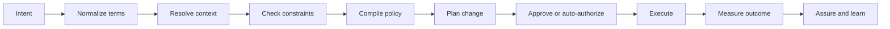

# Intent, policy and assurance

## Intent is not a prompt

An intent says what outcome is wanted without prescribing every implementation detail. A prompt asks a model to produce a response. The two can be combined, but they are not the same engineering object.

A useful intent contains:

* desired outcome
* scope and affected resources
* priority and time horizon
* measurable service objectives
* constraints and forbidden actions
* authority and approval requirements
* evidence required to declare success

For example, “protect the emergency-service slice during a regional traffic surge” is incomplete. A more operational intent identifies the slice, latency and availability objectives, capacity boundary, precedence rules, permitted actions and rollback condition.

## From intent to action

The compilation step is where ambiguity should be exposed. If two intents conflict, the system should not silently choose one because a model found a plausible answer. It should apply an explicit precedence policy or escalate.

## Assurance as a claim with evidence

Assurance is stronger than reporting a metric. It is a claim that a service or system is meeting an objective, supported by evidence whose provenance and time window are known.

An assurance record should answer:

* What was the objective?
* What scope and population were measured?
* Which signals were used?
* What was the observation window?
* What uncertainty or missing data exists?
* Which changes occurred during the window?
* Can another operator reproduce the calculation?

This is especially important when AI is used to summarize incidents or recommend remediation. A fluent explanation is not evidence by itself.

## Conflicts and trade-offs

Network objectives often compete. Lower energy consumption can conflict with redundancy. Aggressive capacity consolidation can increase recovery time. A customer-experience objective can conflict with a cost boundary. The intent system therefore needs explicit priorities and a way to represent acceptable trade-offs.

A practical policy hierarchy is:

1. legal and safety constraints
2. security and privacy constraints
3. service and availability objectives
4. performance optimization
5. efficiency and cost optimization

The exact order depends on the domain, but the order must be visible and testable.

## Thought experiment

An AI system recommends moving user-plane capacity to a cheaper edge location. The predicted latency improves for most users, but the move reduces geographic redundancy. Should the recommendation be accepted? What additional evidence would change the decision?

## Exercise

Write an intent for a hypothetical mobile service during a major event. Include:

* service scope
* target outcome
* three measurable objectives
* two hard constraints
* two permitted automated actions
* one action that requires approval
* rollback condition
* evidence required for closure

Then ask whether each field can be represented in a machine-readable policy without losing its operational meaning.

## Further reading

* [TM Forum Autonomous Networks business requirements and framework](https://www.tmforum.org/resources/introductory-guide/autonomous-networks-business-requirements-and-framework-v3-0-0-ig1218/): business and operational framing for autonomous networks.
* [ITU-T machine learning for future networks](https://www.itu.int/en/ITU-T/focusgroups/ml5g/pages/default.aspx): architectural work on ML functions and interfaces in future networks.
