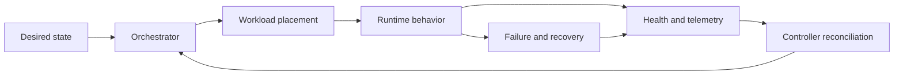

# Cloud-native network functions

## Cloud-native is an operating model

Containers alone do not make a network function cloud-native. The deeper shift is toward declarative configuration, automated scheduling, independent scaling, immutable delivery, observable behavior and failure-aware operation.

A cloud-native network function must make its operational contract visible:

* what it needs to start
* how it reports readiness
* how it handles overload
* how it drains and terminates
* which state is local and which is external
* how it is upgraded and rolled back
* which dependencies are required
* which metrics indicate customer impact

## Deployment loop

The reconciliation loop is related to autonomous-network loops but not identical to one. An orchestrator can restore declared workload state without understanding whether the network service is meeting its customer objective.

## AI opportunities and limits

AI can help forecast resource needs, detect unusual dependency behavior, correlate symptoms, recommend placement or summarize change impact. It should not hide deterministic lifecycle semantics. A model should complement readiness probes, health checks, admission policy, capacity limits and rollback mechanisms.

A common anti-pattern is to use a model to compensate for missing instrumentation. Improve the operational contract first. A model trained on ambiguous signals will learn ambiguity.

## Resilience patterns

Important patterns include:

* bulkheads between workloads and tenants
* timeouts and bounded retries
* graceful degradation
* idempotent reconciliation
* state replication where required
* capacity headroom
* zone and region failure planning
* safe rollout and rollback
* independent verification after change

These patterns also define the action boundaries for an autonomous controller. If a change cannot be rolled back or verified, it needs a higher approval threshold.

## Reference implementations

The [Kubernetes documentation](https://kubernetes.io/docs/home/) is a useful implementation reference for orchestration concepts. The [CNCF Cloud Native Definition](https://github.com/cncf/toc/blob/main/DEFINITION.md) provides a broader vocabulary. These references explain platform behavior; they do not by themselves define telecom-specific service correctness.

## Thought experiment

A controller sees that a network function is unhealthy and replaces the instance. The service recovers, but the replacement uses a configuration version that changes policy behavior. Is the controller successful? What evidence must be included in the health model to detect this class of failure?
