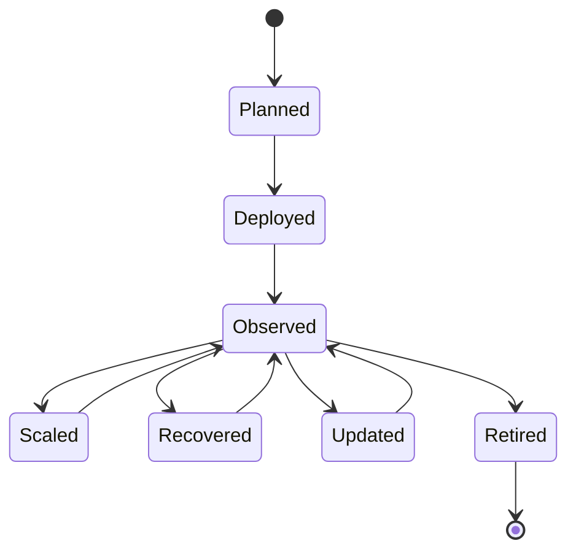

# Cloud-native network functions

## Cloud-native is an operating model

Packaging a network function in a container does not automatically make it cloud-native. The important shift is the operating contract: declarative configuration, automated lifecycle management, observable behavior, failure recovery, elastic placement and explicit dependency handling.

AI systems inherit this contract. A model service that cannot be rolled back, observed or capacity-managed is not production-ready merely because it runs beside a network function.

## The lifecycle

Each transition needs an owner, a health signal and a failure policy. “Running” is not the same as “serving the intended outcome.”

## Operational contracts

A network function or AI service should expose:

- readiness and liveness behavior;
- resource requests and limits;
- dependency health;
- configuration and version identity;
- metrics, logs and traces;
- graceful shutdown and drain behavior;
- rollback and compatibility rules;
- security identity and authorization boundaries.

These signals allow an orchestrator and an operations team to distinguish a bad instance, bad dependency, bad configuration and bad model.

## Resilience patterns

Use multiple layers of protection:

- timeouts and bounded retries;
- circuit breakers for unhealthy dependencies;
- bulkheads to prevent one workload from consuming all resources;
- graceful degradation when analytics is unavailable;
- rolling or canary changes;
- topology-aware placement;
- capacity headroom and disruption budgets;
- explicit state recovery.

An AI recommendation service should fail closed when its action would change a critical control path. It can often fail open to a read-only explanation or a deterministic fallback.

## AI-specific concerns

A model-serving component adds new operational state:

- model version and artifact provenance;
- feature or prompt schema;
- training-data and evaluation version;
- accelerator capacity;
- queue depth and inference latency;
- confidence or abstention behavior;
- policy and tool permissions.

Treat model changes as production changes. A new model can alter the distribution of decisions even when the surrounding service is unchanged.

## Deployment pattern

A guarded deployment can:

1. validate the artifact and dependencies;
2. run offline and replay tests;
3. deploy to a small scope;
4. compare outcome and decision distributions;
5. expand only when guardrails remain satisfied;
6. keep a fast rollback path;
7. record the decision and evidence.

## Exercise

Design a deployment contract for a network analytics service. Specify health checks, resource limits, version labels, rollback triggers, degraded behavior and the evidence needed to expand from one zone to many.

## Further reading

- [Kubernetes documentation](https://kubernetes.io/docs/home/)
- [CNCF cloud native definition](https://github.com/cncf/toc/blob/main/DEFINITION.md)
- [Kubernetes observability](https://kubernetes.io/docs/concepts/cluster-administration/cluster-management/)
