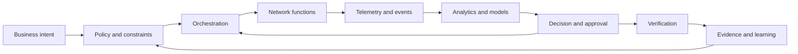

# Autonomous networks, telecom and IT

## The central question

When a network is asked to meet a business outcome, what should be automated, what should be predicted, and what must remain governed by people?

Telecom systems are unusually useful for learning AI systems because they make the consequences of automation visible. A decision can affect latency, reachability, mobility, capacity, security, charging, customer experience and operating cost at the same time. The engineering challenge is not simply to place a model inside a network. It is to connect intent, telemetry, policy, control and evidence into a safe operating loop.

This module treats the network as a socio-technical system. It links standards and architecture to observable behavior, then asks how AI can improve decisions without turning operations into an opaque chain of guesses.

## What this module covers

* [Closed-loop automation](./networks/autonomy/closed-loop-automation): the monitor, analyze, decide, act and verify cycle.
* [Intent and assurance](./networks/autonomy/intent-and-assurance): translating outcomes into policies, controls and measurable service objectives.
* [5G Core architecture](./networks/packet-core/5g-core-architecture): the roles of the major 5G Core network functions and their interfaces.
* [AI use cases in Packet Core](./networks/packet-core/packet-core-ai-use-cases): where prediction, optimization and assistance can help—and where they can mislead.
* [Cloud-native network functions](./networks/cloud-native/cloud-native-network-functions): containers, orchestration, resilience and the operational contract of a network function.
* [AIOps and SRE](./networks/operations/aiops-and-sre): joining network operations with reliability engineering.
* [Standards map](./networks/standards/standards-map): how 3GPP, ETSI, TM Forum, O-RAN, ITU-T and IETF perspectives fit together.
* [Closed-loop lab](./networks/labs/closed-loop-lab): a paper exercise for designing a safe autonomous control loop.
* [Reference shelf](./networks/references): primary standards, official documentation and carefully labeled implementation references.

## A useful distinction

Automation, autonomy and intelligence are related but not interchangeable.

* **Automation** executes a known procedure with limited variation.
* **Autonomy** selects or adapts actions under stated goals and constraints.
* **Intelligence** helps a system interpret uncertain evidence, generalize from examples or reason about alternatives.

A network can be highly automated without being autonomous. It can also contain an advanced model without having an autonomous operating loop. Keeping these distinctions explicit prevents architecture diagrams from becoming marketing diagrams.

## Visual system map

## How to study this module

Start with the closed loop, then read the Packet Core chapters to understand what is being controlled. Follow with cloud-native operations and SRE to see why reliability and rollback matter. Finish with the standards map and the lab; they force the architecture to meet external expectations rather than only internal intuition.

## Thought experiment

Suppose an optimization model reduces congestion during normal traffic but increases recovery time during a regional outage. Is it an improvement? The answer depends on which objective was specified, which evidence was measured, and whether the system was allowed to trade resilience for efficiency.
