# Autonomous networks, telecom and IT

## The question behind the technology

A network is not autonomous because it contains a model. It becomes more autonomous when it can turn an explicit objective into bounded actions, observe the consequences, and change course when reality disagrees with its assumptions.

That distinction matters in telecom and IT because the system being controlled is distributed, stateful and continuously serving users. A change that improves one metric can damage another. More capacity can increase cost. A policy correction can improve one traffic class while harming a different service. A fast remediation can make recovery harder if it destroys evidence or creates configuration drift.

This module studies the whole operating system around the model: intent, telemetry, topology, policy, orchestration, execution, verification, governance and learning.

## What you will be able to do

By the end of this module, you should be able to:

- draw a closed-loop architecture with explicit sensing, decision, actuation and verification boundaries;
- explain the roles of major 5G Core functions and the control-plane/user-plane split;
- distinguish a useful AI recommendation from an unsafe autonomous action;
- map a Packet Core use case to evidence, decision owner, actuator and rollback plan;
- reason about cloud-native network-function failure modes and operational guardrails;
- navigate the relationship between 3GPP, ETSI, TM Forum, O-RAN, ITU-T, IETF and cloud-native practice;
- design a small, measurable autonomy experiment without pretending it is production autonomy.

## A systems view

```mermaid
flowchart LR
    I[Intent and outcome] --> C[Constraints and policy]
    C --> O[Orchestration]
    O --> N[Network and IT functions]
    N --> T[Telemetry events traces]
    T --> S[State and context]
    S --> A[Analytics and models]
    A --> D[Decision proposal]
    D --> G[Safety and authorization gate]
    G --> X[Actuation]
    X --> V[Independent verification]
    V --> E[Evidence audit and learning]
    E --> C
```

The model is only one box in this picture. If the telemetry is incomplete, the policy is ambiguous, the actuator is not idempotent, or verification is weak, a better model does not make the loop safe.

## Automation, autonomy and intelligence

These terms are often used as synonyms, but they describe different properties:

- **Automation** executes a known procedure.
- **Autonomy** selects or adapts an action under a stated objective and constraints.
- **Intelligence** helps interpret uncertain evidence, generalize from examples or reason about alternatives.
- **Assurance** provides evidence that the system is meeting its objectives and remains within its boundaries.

A network may be highly automated but not autonomous. An autonomous loop may use simple rules. A sophisticated model may add intelligence without adding any authority to act.

## A learning route

Start with **Closed-loop automation** and **Intent and assurance**. Then learn the **5G Core architecture** before studying **Packet Core AI use cases**. Continue with **Cloud-native network functions** and **AIOps and SRE**. Finish with the **Standards map** and the **Closed-loop lab**.

## The recurring design question

For every proposed use case, ask five questions:

1. What decision is being improved?
2. What evidence is available at decision time?
3. Which component is authorized to act?
4. How will success and side effects be verified?
5. What is the safe behavior when the model, data or actuator fails?

If a proposal cannot answer these questions, it is probably a demo, not an operating design.

## Thought experiment

Suppose an optimizer lowers average latency by moving user-plane capacity closer to demand, but it increases the probability that a regional failure removes redundancy. Is the optimizer better? The answer depends on whether resilience was an explicit constraint, whether the model was evaluated on failure scenarios, and whether operators can see and reverse its decisions.

## Further reading

The **Reference shelf** collects primary standards, official documentation and implementation references. Use it to move from a conceptual explanation to normative architecture and operational practice.
