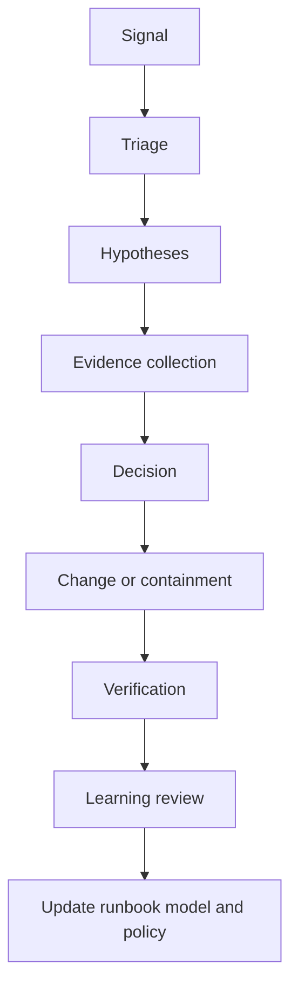

# AIOps and SRE for network operations

## Two complementary perspectives

AIOps emphasizes the use of data, analytics and automation to improve operations. Site Reliability Engineering emphasizes measurable reliability, service objectives, error budgets, operational learning and disciplined change. Together they provide a better foundation for autonomous systems than either “add a model” or “automate every runbook.”

The central question is: which operational decision can be improved while preserving the reliability contract?

## Service-level view

A network component may be healthy while a service is degraded. Define objectives at multiple layers:

* component health
* network-function health
* procedure success
* session establishment
* traffic delivery
* latency and availability
* customer or application experience

Map each AI signal to the layer it represents. A correlation at the component layer should not be presented as proof of a customer-impacting cause.

## Error budgets and automation

An error budget can inform the aggressiveness of automation. When reliability is strong, the system may test a bounded optimization. When the budget is exhausted, the system should prioritize stability, freeze risky changes and increase human review.

This creates an important connection between governance and control: the ability to act should depend on current reliability state, not only on model confidence.

## Incident workflow

AI can assist at every step, but each assistance must declare its evidence and uncertainty. During an incident, speed matters; that is precisely why unsupported certainty is dangerous.

## Observability requirements

At minimum, correlate:

* metrics, logs and traces
* topology and dependency graph
* deployment and configuration versions
* procedure and session identifiers
* customer or service scope
* operator actions and automated actions
* model version and decision record

Without this context, root-cause analysis becomes an exercise in plausible storytelling.

## Practical operating policy

Start with read-only analysis. Add recommendation workflows after the system demonstrates useful precision and calibrated uncertainty. Enable automatic actions only for narrow, reversible and well-observed changes. After every material action, store the prediction, evidence, decision, execution result and verification result.

## Further reading

* [Google Site Reliability Engineering](https://sre.google/sre-book/table-of-contents/): a foundational public reference for SRE principles and practices.
* [Kubernetes observability concepts](https://kubernetes.io/docs/concepts/cluster-administration/observability/): practical signals for cloud-native operations.
