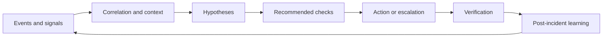

# AIOps and SRE

## AIOps is not a synonym for autonomy

AIOps usually refers to applying analytics, correlation, automation and assistance to operations. SRE provides a discipline for reliability, service objectives, error budgets and learning from failure. Neither automatically grants a system authority to change production.

The useful question is: which operational decision becomes safer or faster, and how will the outcome be measured?

## From event to learning

The loop should reduce toil without hiding uncertainty. An assistant that compresses ten noisy alerts into one evidence-backed incident is valuable even if it never acts automatically.

## SRE concepts that matter

- **Service-level objective:** the reliability target stated from the user or service perspective.
- **Error budget:** the amount of unreliability that can be spent while still meeting the objective.
- **Toil:** repetitive, automatable work that does not create lasting value.
- **Blameless learning:** improve systems and procedures rather than hiding weak signals.
- **Change safety:** release speed is constrained by the ability to detect and recover from harm.

AI can help estimate risk, identify patterns and prepare evidence, but it should not turn the error budget into an opaque optimization target.

## Observability is a causal aid

Metrics show what is changing. Logs show discrete events. Traces show request paths. Topology and configuration show what could have changed. Incident history shows what has happened before.

Correlation becomes more useful when every signal carries time, scope, version and identity. Without these fields, a model may connect unrelated events simply because they appeared near each other.

## A useful incident answer

A production assistant should separate:

- confirmed observations;
- likely explanations;
- competing hypotheses;
- missing evidence;
- recommended next check;
- permitted remediation;
- verification and rollback.

This is more trustworthy than a single root-cause sentence with no uncertainty.

## Measuring operational value

Track both model metrics and service metrics:

| Area | Example measure |
|---|---|
| Detection | precision, recall, lead time and alert stability |
| Investigation | time to first useful hypothesis and evidence coverage |
| Action | acceptance, override, rollback and blast radius |
| Reliability | incident rate, recovery time and objective attainment |
| Human factors | cognitive load, trust calibration and toil removed |
| Cost | compute, storage, licensing and operator time |

## Failure modes

- alert suppression hides a real incident;
- automation closes an incident before verification;
- a model learns the response team's historical bias;
- a root-cause narrative is accepted without testing alternatives;
- an action reduces the symptom while damaging evidence;
- the system optimizes ticket closure rather than service reliability.

## Exercise

Take a noisy incident stream and design a triage assistant. Define the evidence it may retrieve, the claims it may make, the actions it may suggest and the actions it must never perform automatically.

## Further reading

- [Google SRE book](https://sre.google/sre-book/table-of-contents/)
- [Google SRE workbook](https://sre.google/workbook/table-of-contents/)
- [OpenTelemetry documentation](https://opentelemetry.io/docs/)
