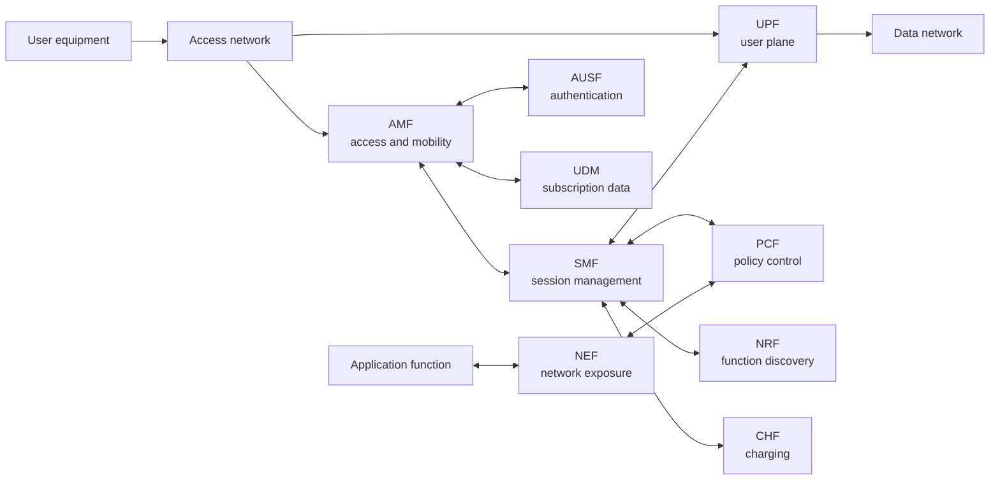

# 5G Core architecture

## Why Packet Core is a useful AI case

The 5G Core is a distributed system with explicit responsibilities, service interfaces, policy decisions, state transitions and operational consequences. That makes it a useful setting for studying AI-assisted operations: the system has rich telemetry, but it also has strict correctness and availability requirements.

The architecture should be learned before the automation. Otherwise, “AI for the Core” becomes a list of vague use cases rather than a map from evidence to a real decision point.

## A simplified view

This is a teaching diagram, not a replacement for the normative architecture. The standards define many more functions, interfaces, procedures and options.

## Control plane and user plane

The control plane establishes and manages connectivity. It handles registration, authentication, session creation, policy application, mobility and lifecycle changes. The user plane forwards traffic and applies the resulting treatment at the data path.

Separating these concerns supports independent placement and scaling. It also creates an operational dependency: a healthy user plane with a degraded control plane may continue existing sessions while failing new ones; a healthy control plane with an impaired user plane may establish sessions that cannot carry traffic.

The distinction matters for diagnosis and for AI. A model that sees only aggregate traffic may miss a control-plane saturation problem. A model that sees only signaling may misclassify a data-plane path failure.

## Service-based architecture

In a service-based architecture, network functions expose services to authorized consumers. This encourages modularity and discoverability, but it also increases the importance of API health, identity, authorization, dependency mapping and version compatibility.

For operational analysis, collect at least:

* request rate and response latency by service
* error and timeout rates
* dependency and retry behavior
* instance health and placement
* policy and configuration version
* subscriber or session cohort where appropriate
* control-plane and user-plane correlation identifiers

## Network functions as decision boundaries

Each network function owns part of the system state. An AI recommendation should identify which function can execute the action and which other functions may be affected. This prevents the common failure mode where an analytics system proposes a change that no authorized component can safely apply.

## Learning path

Read this chapter with [AI use cases in Packet Core](./packet-core-ai-use-cases), then compare the operational model with [cloud-native network functions](../cloud-native/cloud-native-network-functions). Use [3GPP TS 23.501](https://www.3gpp.org/DynaReport/23501.htm) for system architecture and [3GPP TS 23.502](https://www.3gpp.org/DynaReport/23502.htm) for procedures.

## Thought experiment

A model predicts that a session-management bottleneck will occur in ten minutes. It can scale the function now, but the prediction has a false-positive rate that creates unnecessary cost. Which evidence, policy and rollback mechanism would justify automatic action?
