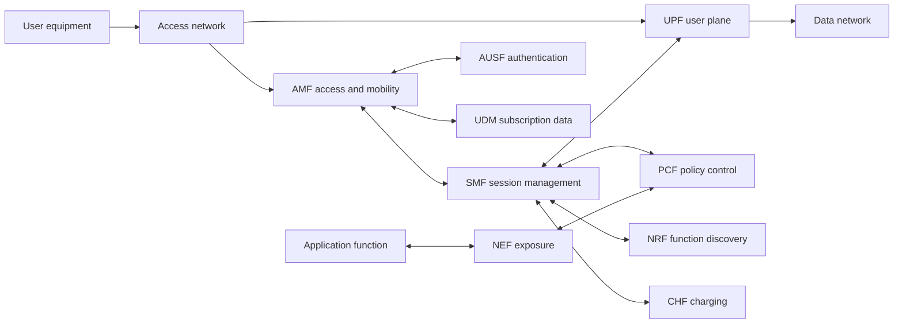

# 5G Core architecture

## Why architecture comes before AI

A model cannot reason about a system it has not been taught to observe. The 5G Core is a useful AI case because it combines explicit functions, service interfaces, policy decisions, distributed state and strict operational consequences.

Before asking what AI can do, identify where the decision lives, which evidence is available, which function owns the state, and what an incorrect action would affect.

## A simplified architecture

This is a teaching model, not a normative replacement for the architecture specifications.

## Major responsibilities

| Function | Primary responsibility | Useful operational evidence |
|---|---|---|
| AMF | access, registration and mobility management | registration outcomes, mobility events, signaling latency |
| SMF | session management and user-plane selection | session procedures, selection decisions, setup latency |
| UPF | user-plane forwarding and traffic treatment | throughput, packet loss, latency, resource saturation |
| PCF | policy decisions and rules | policy requests, version, decision latency, conflicts |
| UDM and AUSF | subscription and authentication services | authentication outcomes, dependency latency, failure cohorts |
| NRF | discovery and service availability | registration, discovery, health and dependency errors |
| CHF | charging interaction | charging requests, failures and reconciliation state |
| NEF | controlled exposure to applications | API calls, authorization, quotas and policy impact |

The boundaries are analytically useful. Real deployments include additional functions, options and implementation details.

## Control plane and user plane

The control plane establishes and manages connectivity. It handles registration, authentication, session creation, policy application, mobility and lifecycle changes. The user plane carries traffic and applies the resulting treatment in the data path.

The separation enables independent placement and scaling, but it also creates diagnostic traps:

- a healthy user plane can continue existing sessions while new sessions fail;
- a healthy control plane can establish sessions that cannot carry traffic;
- aggregate traffic can look normal while signaling is saturated;
- a signaling symptom can be caused by a user-plane or dependency failure.

AI features must preserve these distinctions. A model that sees only one plane will produce confident but incomplete explanations.

## Service-based architecture

Network functions expose services to authorized consumers. This improves modularity and discoverability, but it makes API health, identity, authorization, dependency mapping and version compatibility central operational signals.

For analysis, correlate:

- request rate, latency, errors and timeouts;
- retries and dependency chains;
- instance health and placement;
- policy and configuration versions;
- procedure outcome and cohort;
- control-plane and user-plane identifiers;
- recent changes and software versions.

## Where AI can fit

AI can assist with anomaly detection, procedure classification, dependency analysis, demand forecasting, capacity planning, policy simulation and operator explanation. It should not be allowed to bypass function ownership or normative procedures.

A good recommendation names the responsible function and the observable action. “Optimize the Core” is not an action. “Increase SMF capacity in zone B within the approved budget, then verify session-establishment latency and redundancy” is closer to an executable decision.

## Failure scenario

A model reports rising session-establishment failures. The failures are not caused by the SMF itself; a dependency timeout is increasing between two services. A component-only dashboard points to the wrong actuator. A procedure-aware analysis correlates the failure sequence, dependency latency, recent change and affected cohort before proposing action.

## Exercise

Choose one procedure—registration, authentication or session establishment. Draw its major steps, list the evidence for each step, and mark which evidence is authoritative, delayed or inferred. Then identify the earliest point at which an AI assistant could provide value without making a control-plane change.

## Further reading

- [3GPP TS 23.501](https://www.3gpp.org/DynaReport/23501.htm)
- [3GPP TS 23.502](https://www.3gpp.org/DynaReport/23502.htm)
- [3GPP specification portal](https://www.3gpp.org/DynaReport/)
