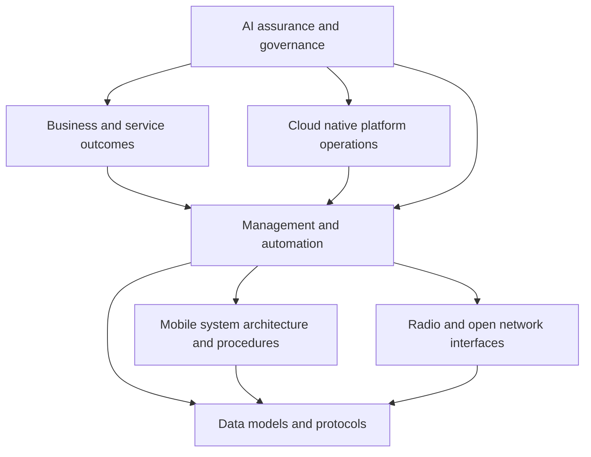

# Standards map

## Why the map matters

Standards are not a single stack with one owner. They describe different boundaries: system architecture, interfaces, management, automation, data models, security, deployment and operations. A useful tutorial should show the relationship without implying that one body defines the whole solution.

## A layered map

## Major perspectives

| Perspective | What it contributes | How to use it |
|---|---|---|
| 3GPP | mobile system architecture, procedures and requirements | anchor Packet Core and 5G system claims |
| ETSI ZSM | zero-touch management and orchestration framing | study cross-domain automation and management |
| ETSI ENI | experience-driven and cognitive network perspective | examine policy, context and AI-oriented control |
| TM Forum | business requirements, maturity and open management APIs | connect autonomy to service and operating models |
| O-RAN Alliance | open and intelligent RAN ecosystem | study RAN interfaces and near-real-time control concepts |
| ITU-T | recommendations and architectural studies | understand global terminology and future-network framing |
| IETF | protocols, data models and Internet operations | anchor interfaces and management assumptions |
| CNCF and Kubernetes | cloud-native lifecycle and platform practice | understand deployment, resilience and observability |

## How to read a standard

Do not begin by searching for the word “AI.” Start with:

1. scope and status;
2. terminology and definitions;
3. actors and responsibilities;
4. interfaces and information exchanged;
5. lifecycle and failure behavior;
6. security and authorization assumptions;
7. conformance or implementation guidance.

Then ask where an AI component would consume evidence, propose a decision or affect an interface. This prevents the model from being treated as a magical layer above the normative system.

## Standards versus implementation

A standard can define a requirement without prescribing a single implementation. An implementation can be useful without being normative. Keep the distinction visible in the tutorial and in design reviews.

For every external claim, record:

- source organization;
- document title and version;
- normative or informative status;
- relevant scope;
- date checked;
- interpretation used by the tutorial.

## Exercise

Pick one autonomy use case. Find one normative source, one management or business framework, and one implementation reference. Write what each source can prove, what it cannot prove, and where the sources use different terminology.

## Further reading

- [3GPP specification portal](https://www.3gpp.org/DynaReport/)
- [ETSI ZSM](https://www.etsi.org/technical-groups/zsm/)
- [ETSI ENI](https://www.etsi.org/technical-groups/eni/)
- [TM Forum Autonomous Networks](https://www.tmforum.org/missions/autonomous-networks)
- [O-RAN Alliance](https://www.o-ran.org/)
- [ITU-T machine learning for future networks](https://www.itu.int/en/ITU-T/focusgroups/ml5g/pages/default.aspx)
- [IETF RFC Editor](https://www.rfc-editor.org/)
