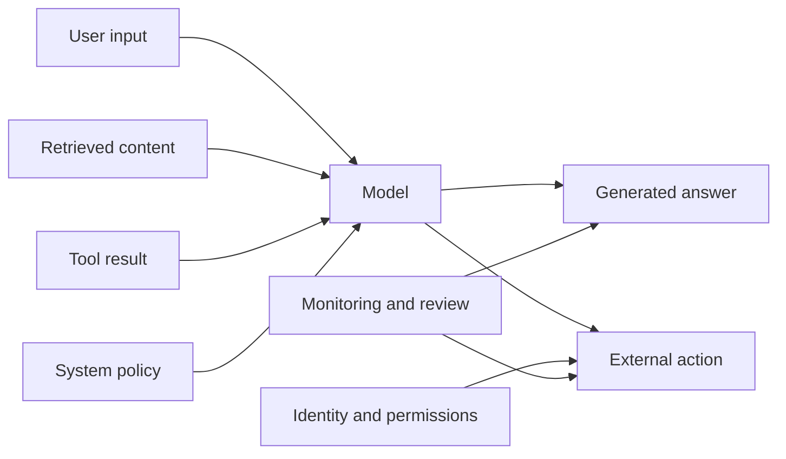

# Trustworthy AI: controls around capability

Trust is not a personality trait of a model. It is an engineered property of the complete system and its operating environment.

## Threat model the system, not only the prompt

Every arrow is a possible control point and a possible attack surface. Prompt injection is one example; data leakage, unsafe tool permissions, supply-chain compromise, and misleading evaluation are others.

## A control stack

| Layer | Example control |
|---|---|
| Identity | Authenticate users and services; preserve provenance |
| Data | Enforce permissions before retrieval and action |
| Prompt and context | Separate trusted instructions from untrusted content |
| Model | Test known failure modes; constrain output where useful |
| Tools | Least privilege, validation, confirmation, idempotency |
| Runtime | Rate limits, timeouts, isolation, circuit breakers |
| Oversight | Human escalation, audit logs, incident response |

Controls should be layered because no single guardrail is perfect.

## Safety is contextual

The right control depends on the consequence of failure. A playful brainstorming assistant and an agent that changes production configuration should not have the same autonomy, permissions, or release process.

A useful design question is:

> What is the maximum harm this system can cause without another person or system noticing?

If the answer is unacceptable, reduce the action space, increase observability, or require approval.

## References for the control conversation

* [NIST AI Risk Management Framework](https://www.nist.gov/itl/ai-risk-management-framework) provides a risk-management structure for AI systems.
* [OWASP Top 10 for Large Language Model Applications](https://owasp.org/www-project-top-10-for-large-language-model-applications/) catalogs important application risks.
* [MITRE ATLAS](https://atlas.mitre.org/) maps adversarial tactics and techniques relevant to AI-enabled systems.

## Reality check

A refusal message is not proof of safety. A safe system also needs correct permissions, trustworthy data handling, bounded actions, incident visibility, and a recovery path.

## Thought experiment

Would you rather deploy a more capable agent with narrow permissions or a less capable agent with broad permissions? The answer depends on whether the system can explain, verify, and reverse its actions—not only on how often it succeeds.
