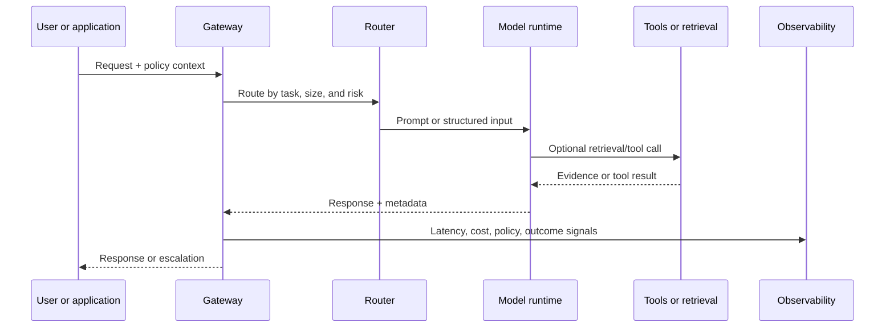

# Inference and serving: where intelligence meets physics

Training asks, “Can the model learn?” Serving asks, “Can the system respond on time, at acceptable cost, under real demand?”

## The serving path

The model is only one participant. Gateways, routers, caches, retrieval services, tool permissions, and observability determine the behavior users experience.

## The latency budget

End-to-end latency is usually a sum of several terms:

$$
T_{total}=T_{queue}+T_{input}+T_{prefill}+T_{decode}+T_{tool}+T_{postprocess}
$$

Reducing model computation while ignoring queueing or tool latency may produce no visible improvement.

## Core optimization levers

* **Batching:** serve multiple requests together to use hardware efficiently.
* **Quantization:** represent weights or activations with lower precision when quality remains acceptable.
* **Caching:** reuse repeated prefixes, retrieval results, or deterministic transformations.
* **Speculative decoding:** use a faster draft path to accelerate a larger model.
* **Routing:** send simple tasks to smaller models and complex tasks to stronger ones.
* **Streaming:** return partial output when the interaction benefits from early feedback.
* **Admission control:** protect the system when demand exceeds safe capacity.

Each lever trades something: memory, quality, complexity, fairness, or debuggability.

## The cost of a token is not the cost of a task

A short prompt can trigger multiple retrieval calls, tool invocations, retries, and human escalations. Track cost at the **task and workflow** level, not only at the model API level.

## Reliability patterns

A dependable serving layer should support:

* timeouts and bounded retries
* idempotent tool calls
* circuit breakers
* fallbacks and graceful degradation
* model and prompt versioning
* structured outputs with schema validation
* redaction and access controls
* replayable traces for investigation

## Industry references

* [TensorRT-LLM documentation](https://nvidia.github.io/TensorRT-LLM/) describes optimization techniques for large-language-model inference.
* [vLLM documentation](https://docs.vllm.ai/) documents an open serving stack and its runtime concepts.
* [MLPerf Inference](https://mlcommons.org/benchmarks/inference/) provides a standardized way to compare inference performance across workloads and systems.

These sources illustrate an important point: infrastructure choices are part of AI capability because they determine which interactions are economically and operationally possible.

## Think deeper

If a model is accurate but too slow to use, is the model weak—or is the product asking it to solve the wrong problem in one expensive step?
