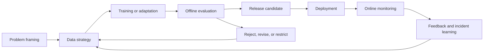
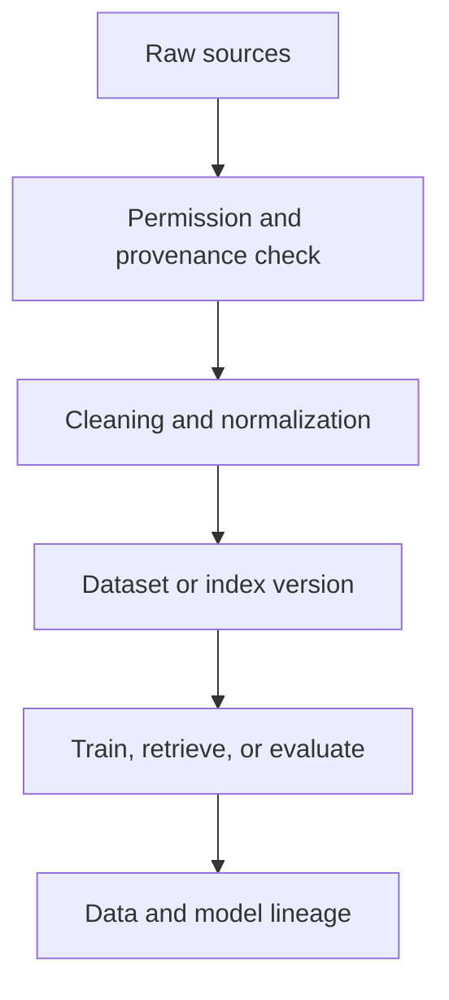

# The model lifecycle: from data to dependable capability

A model is not finished when training ends. It is finished—temporarily—when the surrounding system can justify its behavior under the conditions that matter.

## The lifecycle map

The loop is intentionally circular. New data, new failure modes, changing policies, and changing user behavior can invalidate an earlier release.

## Stage 1: frame the decision

Begin with the decision, not the model. Define:

* who or what consumes the output
* what action follows from it
* what “good” means
* what errors are unacceptable
* where a human can intervene
* what evidence must be retained

A request such as “add an AI assistant” is not yet a testable problem. “Reduce time to locate an approved procedure while preserving source traceability” is closer.

## Stage 2: build the data contract

The data contract should describe provenance, permissions, freshness, representation, and deletion behavior. It should also specify what the system must **not** learn or expose.

Data quality is not a single score. A dataset can be clean and still be irrelevant, biased toward easy cases, stale, or missing rare failures.

## Stage 3: choose the adaptation path

Not every problem needs pretraining or fine-tuning. The main options include:

* prompt and context design
* retrieval augmentation
* supervised fine-tuning
* parameter-efficient adaptation
* preference or reinforcement-based post-training
* a smaller specialist model
* a deterministic system with an AI component only where it adds value

The right question is not “Which model is strongest?” It is “Which capability can be delivered with the smallest uncontrolled surface area?”

## Stage 4: evaluate before release

Evaluation should include normal cases, adversarial cases, boundary cases, and cases where the correct behavior is to refuse or ask for clarification. A single benchmark score is not a release argument.

## Stage 5: operate and learn

Production telemetry should connect model behavior to user outcomes. Useful signals include:

* task success and correction rate
* groundedness or evidence coverage
* latency and cost
* tool-call failures
* safety policy violations
* abstention and escalation rates
* drift in inputs, outputs, and user intent

## Release gates

A practical release gate can ask:

| Gate | Question |
|---|---|
| Capability | Does it perform the intended task? |
| Reliability | Does it behave consistently across important slices? |
| Safety | Are high-severity failures blocked or escalated? |
| Operability | Can we observe, roll back, and investigate it? |
| Governance | Are ownership, permissions, and evidence clear? |

## Thought experiment

Suppose a new model improves average task accuracy by 8% but doubles latency and makes rare high-impact errors harder to detect. Is it an improvement, or only a better benchmark result?
