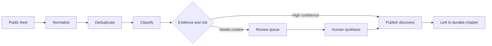

# The daily update contract

The daily layer is a **discovery system first**. It collects public signals, preserves provenance, and makes editorial work easier. It does not turn an RSS title into a conclusion automatically.

## The lifecycle

## Minimum record

Every discovery should retain:

| Field | Purpose |
|---|---|
| `id` | Stable identifier derived from the canonical URL |
| `status` | `NEW`, `UPDATED`, or `CORRECTION` |
| `title` | The source title, not a rewritten claim |
| `source` | Publisher or feed name |
| `url` | Canonical public source link |
| `published` | Source publication timestamp when available |
| `topic` | One or more atlas topics |
| `evidence_tier` | A transparent indication of source proximity |
| `review` | Whether editorial review is required |

## Evidence tiers

- **Tier 1 — Primary:** paper, standard, official documentation, release note, regulator, or first-party announcement.
- **Tier 2 — Reputable secondary:** reporting or analysis that clearly links to primary evidence.
- **Tier 3 — Discovery only:** search result, social post, unattributed claim, or source with unclear provenance.

Tier 3 items may help us find a story, but they should not become strong tutorial claims or quotes without verification.

## What automation may publish

The zero-cost pipeline may publish a dated discovery page containing the source title, URL, timestamp, topic, and a short source-provided summary. It should not invent:

- Quotes
- Performance numbers
- Causal explanations
- Competitive comparisons
- Regulatory conclusions
- Forecasts presented as facts

Those belong in the review queue until verified and rewritten with context.

## What makes an update valuable

A good update connects the signal to the map:

1. **What changed?** State the source event without hype.
2. **Why might it matter?** Explain the mechanism or decision affected.
3. **Where does it belong?** Link to the durable chapter.
4. **What remains uncertain?** Name missing evidence or competing interpretations.
5. **What should we watch next?** Define a falsifiable follow-up.
