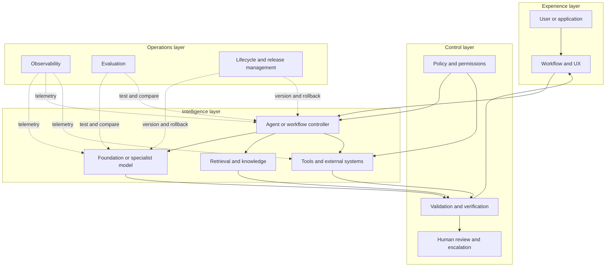

# Visual map: an AI system is more than a model

Use this map whenever a conversation jumps directly from “which model?” to “how do we deploy it?” The missing layers are usually where the real design work lives.

## How to read it

* The **experience layer** defines the user’s actual task.
* The **intelligence layer** supplies prediction, retrieval, planning, and action.
* The **control layer** limits what can happen and detects what went wrong.
* The **operations layer** makes the system changeable, observable, and accountable.

The layers are not strictly sequential. They form a feedback system.

## The design test

For any proposed AI feature, identify:

1. The user decision or workflow being improved
2. The model capability required
3. The data and retrieval path
4. The tools and permissions involved
5. The verification and escalation path
6. The metrics that determine whether to keep it

If any answer is missing, the feature is probably still a demo rather than a system design.
