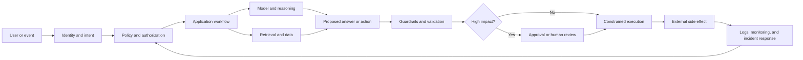

# Visual map: the trustworthy AI system

The diagram separates capability from authority. The model can propose an answer or action, but policy, identity, and operational controls determine what may happen next.

## How to read it

- Identity and policy establish authority.
- Retrieval supplies evidence but does not grant permission.
- The model proposes; validation constrains.
- High-impact actions receive stronger friction.
- Monitoring closes the loop by turning incidents into changed controls.

## Design prompt

For the AI system you are studying, mark every point where untrusted content can enter and every point where a side effect can occur. The distance between those points is where many useful controls can be placed.
