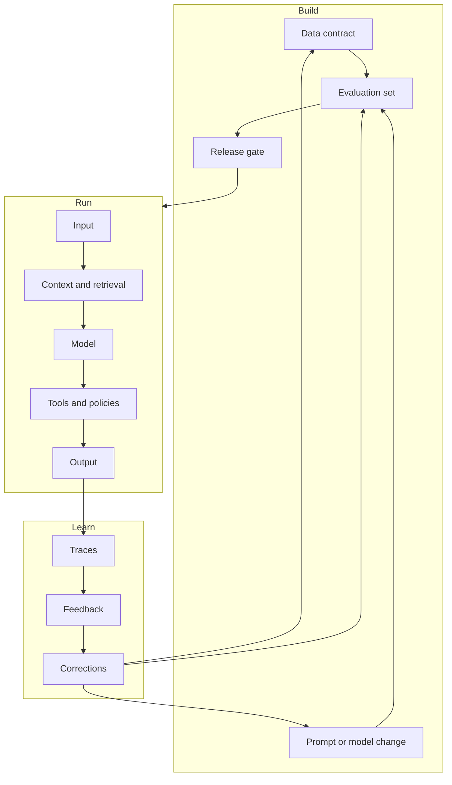

# Production AI system map

This map shows why production AI is a system problem. The model is important, but it is one component in a loop that includes data, runtime controls, evaluation, and feedback.

## How to read it

* The build loop defines what should happen.
* The run loop executes the behavior.
* The learning loop reveals what actually happened.
* A mature system connects the three without allowing uncontrolled changes to reach users.

## Question

Where would you place a human reviewer in this map? The answer depends on risk, reversibility, and the cost of waiting.
