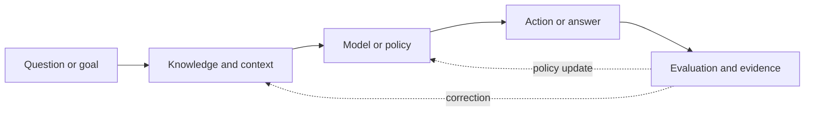

# How to read the Atlas

AI systems are easier to understand when the **data path**, **decision path**, and **control boundary** are visible. The Atlas uses a small visual grammar so readers can recognize those patterns across very different topics.

## Three visual questions

When you meet a new diagram, ask:

1. **What flows?** Data, tokens, observations, actions, evidence, or feedback?
2. **What decides?** A model, a policy, a router, a human, or an external system?
3. **What can fail?** Missing context, wrong retrieval, unsafe action, stale state, or an unmeasured objective?

## The recurring shapes

| Visual element | Meaning |
|---|---|
| Solid arrow | A runtime flow or dependency |
| Dashed arrow | Feedback, evaluation, or a possible branch |
| Rounded box | A component with an interface |
| Boundary box | A trust, ownership, or governance boundary |
| Amber callout | A trade-off, uncertainty, or failure mode |
| Teal callout | An operational or deployment implication |

## The Atlas loop

The loop is deliberately broader than a model call. A useful AI system includes the context it receives, the actions it can take, and the feedback used to decide whether it worked.

## Visual discipline

A graphic should earn its place. Each diagram in the tutorial should answer at least one of these questions:

- Where does information enter and leave?
- Where can an error be introduced or amplified?
- Which component can be replaced independently?
- Where is a human approval or policy gate required?
- What would we measure in production?

If a diagram cannot answer one of these, it is probably decoration rather than explanation.
